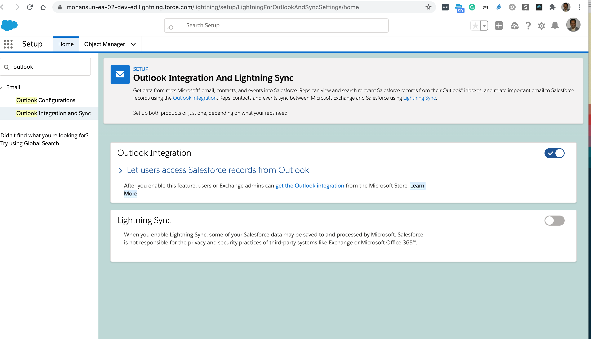

# Outlook Integration and Einstein Activity Capture (EAC)

## Features
- Get data from rep’s Microsoft® 
    - email
    - contacts, 
    - events 
into Salesforce. 
- Reps can view and search relevant Salesforce records from their Outlook® inboxes
    - **Relate** important emails to Salesforce records using the Outlook integration. 
- Reps can find the same, up-to-date information whether they’re working in Salesforce or Outlook
- Spend less time entering data and switching between the two applications ( Salesforce and Outlook)

## What about Lightning Sync
- Lightning Sync also syncs contacts and events. 
    - Starting in Winter ’21, Lightning Sync availability is changing. 
        - Moving forward, Einstein Activity Capture(EAC) is the **llong-term solution**l for syncing contacts and events between your Microsoft or Google applications and Salesforce. 
        - If you run Lightning Sync today and want to move to Einstein Activity Capture, 
            - first turn Lightning Sync off. 
             - The setting is located in the Lightning Sync section of the Outlook Integration and Sync page in Salesforce setup.

## EAC
- It is more than just contact and event syncing.
- Emails and events that reps send and receive are automatically added to the activity timeline of related records.
    - when subsequent activity occurs on added emails or events, that new activity is automatically added to Salesforce.
- Gives sales reps critical sales context alongside relevant emails.
- Shows a summary of sales activities that were added to Salesforce manually and by Einstein Activity Capture
- Activity Metrics
    - Gives sales teams the complete picture about activity data, and lets you create processes based on activity data
- Recommended connections
    - Lead and contact records show which colleagues have the **strongest connection** to a prospect.
        - Makes it easy to connect with prospects to find new business.

## EAC requirements
- Supports up to 100 users on the Standard Salesforce license with Sales Cloud purchase. 
    - To set up more than 100 users for Einstein Activity Capture, a paid upgrade to Sales Cloud Einstein, Inbox, or High Velocity Sales is required.

### Email Server
- Exchange 2019, 2016, or 2013 on-premises
- Exchange Online with Office 365®
- Salesforce admins need to work with the Exchange admins when setting up the integration.
### Email Client
- [Outlook Integration System Requirements](https://help.salesforce.com/articleView?id=sf.app_for_outlook_system_requirements.htm&type=5)
- For best experience:
    -  we recommend using an Outlook version that supports pinning the Salesforce pane so that it’s always open.
- To run the integration in Outlook, 
    - Each user must have the Salesforce add-in, available in the Microsoft AppSource store. 
    - Your Exchange or Office 365 administrator can install the Outlook integration for all users with Microsoft Centralized Deployment. 
        - Or, if Outlook users can access the store, they can install the integration themselves.
#### Browsers
- Google Chrome™, most recent stable version
- Mozilla® Firefox®, most recent stable version
- Apple® Safari® 10 or later, most recent stable version recommended
- Microsoft Edge, most recent stable version (Windows only)

### Data Storage
- Data is stored on Microsoft servers and Salesforce servers only. 
- If customers upgrade to **Inbox**, some data is stored on Salesforce Amazon Web Service (AWS) servers.

## Setup
- 
-   This setting enables Reps add (or log):
    - Outlook **emails** and their attachments to Salesforce records as **Salesforce emails**. 
    - **events** and their attachments to Salesforce records as well. When you use Einstein Activity Capture, email and event capture automatically adds Outlook emails and events to the activity timeline of related Salesforce records.

- At the Rep side [Access the Outlook Integration](https://help.salesforce.com/articleView?id=sf.app_for_outlook_user_setup_1.htm&type=5)
    - Access the Outlook Integration:
        - The Outlook integration is an **add-in for Microsoft® Outlook®**. 
        - To start using the integration, you need the Salesforce add-in. 
            - How you get the add-in is up to the Salesforce admin and the IT team. 
                - After the add-in is installed, you can launch it, connect your email account, and then manage the add-in like you do other Microsoft add-ins.

## References

- [Which Email Integration Product Is Right for My Company?](https://help.salesforce.com/articleView?id=sf.sfo_vs_email_connect.htm&type=5)  
- [Compare Einstein Activity Capture and Lightning Sync](https://help.salesforce.com/articleView?id=sf.email_integration_admin_eac_vs_lightning_sync.htm&type=5)
- [Einstein Activity Capture](https://help.salesforce.com/articleView?id=sf.einstein_sales_aac.htm&type=5)
- [Set Up the Outlook Integration and Einstein Activity Capture](https://trailhead.salesforce.com/en/content/learn/modules/outlook_integration/outlook_integration_unit_3)

### Setup
- [Set Up the Integration with Outlook](https://help.salesforce.com/articleView?id=sf.app_for_outlook_setup_parent.htm&type=5) 

